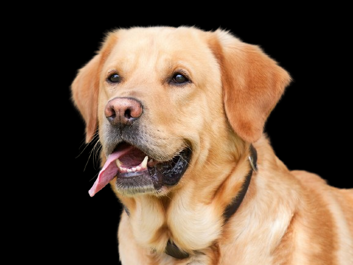
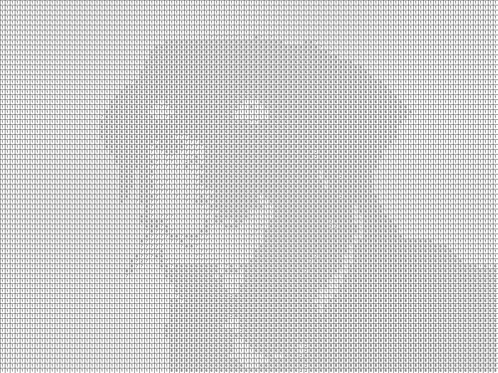
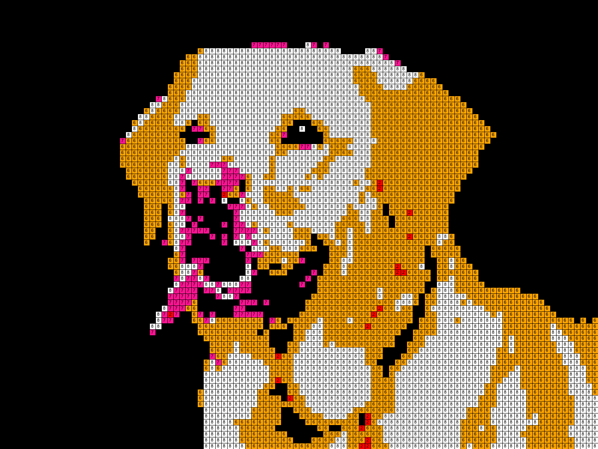

# Projet de Pixel Art

## Description
Ce projet consiste à générer des images de pixel art en utilisant une palette de couleurs prédéfinie. Chaque image est transformée pour ne contenir que les couleurs spécifiées, créant ainsi un style unique de pixel art. Ce projet combine l'art génératif avec des techniques de manipulation d'image pour créer des œuvres visuellement captivantes.

## Technologies Utilisées
- Python 3
- Bibliothèque PIL (Python Imaging Library)

## Fonctionnalités
- Redimensionnement des images en conservant leur ratio.
- Application d'une palette de couleurs personnalisée.
- Génération de deux versions de pixel art : une version en couleur et une autre en noir et blanc avec des numéros.

## Palette de Couleurs
La palette utilisée dans ce projet comprend les couleurs suivantes :
1. Noir (0, 0, 0)
2. Rouge (255, 0, 0)
3. Vert (0, 255, 0)
4. Bleu (0, 0, 255)
5. Jaune (255, 255, 0)
6. Orange (255, 165, 0)
7. Rose (255, 20, 147)
8. Blanc (255, 255, 255)

## Exemples d'Images Générées
Les images ci-dessous montrent quelques exemples de pixel art généré à partir de ce projet :
- Image d'un chien (couleurs limitées à la palette ci-dessus)







## Installation et Utilisation
Pour utiliser ce projet, assurez-vous d'avoir Python et PIL installés. Clonez ce dépôt et exécutez le script Python pour générer votre propre pixel art.

```bash
git clone https://github.com/dimaland1/PixelArtGenerator.git
cd PixelArtGenerator
python main.py
